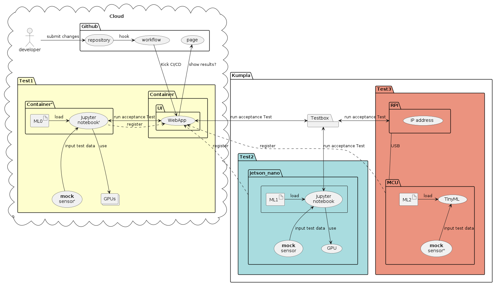

Run [Hello World](https://github.com/tensorflow/tflite-micro/tree/main/tensorflow/lite/micro/examples/hello_world)
example of [TensorFlow Lite for Microcontrollers](https://www.tensorflow.org/lite/microcontrollers/get_started_low_level)
in Docker automatically, hooked in CI (Github workflow). You'll implement the following "Test1".

# Slides
- https://github.com/Origami-TinyML/software-engineering-project/blob/artifacts/kickoff.pdf
- https://github.com/Origami-TinyML/software-engineering-project/blob/artifacts/soft_eng_proj_tinyml_lifecycle.md

# Sprint 0
You can skip training part for now. You need the following steps:

1. git clone TensorFlow repo
2. Follow hello world example instruction
3. Run make with appropriate parameter for standalone x86[*](https://www.tensorflow.org/lite/microcontrollers/library#generate_projects_for_other_platforms)
4. Build an executable binary with a model compiled in[*](https://github.com/ehirdoy/tflm)
5. Run an executable binary on x86[*](https://www.tensorflow.org/lite/microcontrollers/library#build_binaries)[*](https://asciinema.org/a/552162)
6. Put the above all in a container, reproducible with Docker file
7. Add an unit test for this hello world[*](https://www.tensorflow.org/lite/microcontrollers/library#run_the_tests)
8. Add coverage measurement infrastructure (gcov in C?)
9. Add dashboard of coverage (github page?)
10. Hook PR in CI / CD (github action / workflow)
11. Anything more here?

Please feel free to edit this document to share information with others correctly.

#  Sprint 1
This time, we'll add training part as WebApp.
[This](https://blog.devgenius.io/testing-streamlit-a1f1fd48ce8f) helps for the following.

1. Train with Jupyter notebook
2. Convert to WebApp with streamlit
3. Add test & coverage
4. Dockerize
5. Hook in CI / CD

